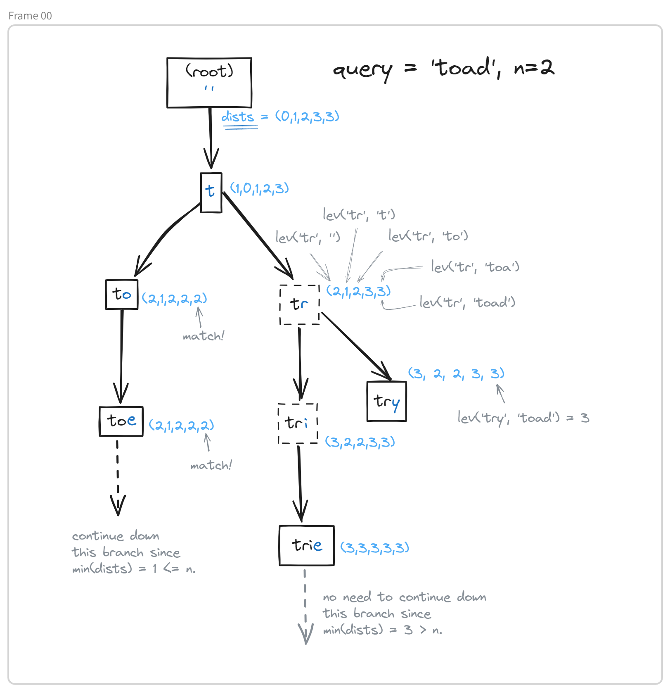

# 🔍 Simple Typo-Tolerant Search Engine Demo

How many lines of code to implement a typo-tolerant search engine in Python, without any dependencies? 

**Only 76!**

The code is shown below and in `simplesearch.py`. Unit tests are in `test.py`

## How it works:

#### Big picture:

1. Tokenize documents.
2. Create an [inverted index](https://en.wikipedia.org/wiki/Inverted_index) to quickly lookup documents from terms.
3. Combine a [trie](https://en.wikipedia.org/wiki/Trie) with an adaptation of the usual Levenshtein distance algorithm for typo-tolerant search with optimal time complexity O(`#terms` x `max_levenshtein_distance`).

#### In some detail:

At the core of this implementation is the algorithm for fuzzy searching the trie, which is a variation of the algorithm used to compute the [Levenshtein distance](https://en.wikipedia.org/wiki/Levenshtein_distance). 
It's a depth first search of the trie:
- At each node, we associate a vector `dists` such that `dist[i]` represents the Levenshtein distance between `query[:i]` and the word represented by the current node.
- By capping the maximum Levenshtein distance at `n`, this computation can be performed with `2*n+1` time complexity using the parent node's `dists` vector.
- Furthermore, the `dists` vector allows for both (1) determining the Levenshtein distance between the query and the current word, and (2) checking whether or not descendants of the current node could potentially match. So we're both effieciently computing the Levenshtein distance and only exploring relevant branches of the trie.

Here's what the trie and the attached `dists` vectors might look like:

<p align="center">

</p>

## Full code:

```python
import string
from collections import defaultdict


class Node:
    def __init__(self, word="", parent=None):
        self.word = word
        self.parent = parent
        self.children = defaultdict()
        self.dists = None
        self.is_word = False


class Trie:
    def __init__(self):
        self.root = Node()

    def preprocess(self, doc):
        return (
            doc.lower()
            .translate(str.maketrans("", "", string.punctuation))
            .encode("ascii", "replace")
            .decode()
        )

    def insert(self, word):
        word = self.preprocess(word)
        node = self.root
        for i, char in enumerate(word):
            node = node.children.setdefault(char, Node(word[: i + 1], node))
        node.is_word = True

    def fuzzySearch(self, query, n):
        query = self.preprocess(query)
        matching_set, visited, stack = set(), set(), [self.root]
        while stack:
            node = stack.pop()  # Depth first search
            if node not in visited:
                node.dists = self.get_levenshtein_dists(node, query, n)  # node.dists[i] = min(distance(node.word, query[:i]), n + 1)
                if node.is_word and node.dists[-1] <= n: # Check for a matching word
                    matching_set.add(node.word)
                if min(node.dists) <= n:  # Check whether to continue down the branch.
                    stack.extend(node.children.values())
        return matching_set

    def get_levenshtein_dists(self, node, query, n):
        if node.parent is None:
            return range(len(query) + 1)
        dists = [n + 1] * (len(query) + 1)
        dists[0] = len(node.word)
        prev_dists = node.parent.dists
        # node.parent.dists and node.dists are the two rows used in the classical Levenshtein distance algorithm
        # It's not necessary to iterate over the full range(len(query)) since we're capping the Levenshtein distance at n
        for i in range(max(0, dists[0] - n - 1), min(len(query), dists[0] + n + 1)):
            dists[i + 1] = (
                prev_dists[i]
                if query[i] == node.word[-1]
                else 1 + min(prev_dists[i], prev_dists[i + 1], dists[i])
            )

        return dists


class Index:
    def __init__(self, documents):
        self.trie = Trie()
        self.inverted_index = defaultdict(lambda: set())
        for doc in documents:
            for word in doc.split():
                self.trie.insert(word)
                self.inverted_index[word].add(doc)

    def fuzzySearch(self, query, n):
        return {
            doc
            for word in self.trie.fuzzySearch(query, n)
            for doc in self.inverted_index[word]
        }
```

## Example:

```python
from simplesearch import Index

docs = [
    "Wikipedia is hosted by the Wikimedia Foundation, a non-profit organization that also hosts a range of other projects.",
    "The Hrabri class con­sist­ed of two sub­ma­rines built for the King­dom of Serbs, Croats and Slo­venes. The first sub­ma­rines to serve in the Royal Yugoslav Navy (KM), they arrived in Yugoslavia on 5 April 1928, and participated in cruises to Mediterranean ports prior to World War II."
    "Did you know that Jean-Emmanuel Depraz (pictured) won a Magic: The Gathering world championship using three cards depicting the player who beat him in 2021?"
]

index = Index(docs)
index.fuzzySearch("Willipedia", 2)
## {'Wikipedia is hosted by the Wikimedia Foundation, a non-profit organization that also hosts a range of other projects.'}
```

## Notes:

- This demo is only optimized for time complexity, not memory.
- Obviously, it's not a very refined search engine. It's just efficient single-term fuzzy search and corresponding document lookup. 

## Further reading:

- http://blog.notdot.net/2010/07/Damn-Cool-Algorithms-Levenshtein-Automata
- https://julesjacobs.com/2015/06/17/disqus-levenshtein-simple-and-fast.html
- https://blog.mikemccandless.com/2011/03/lucenes-fuzzyquery-is-100-times-faster.html
